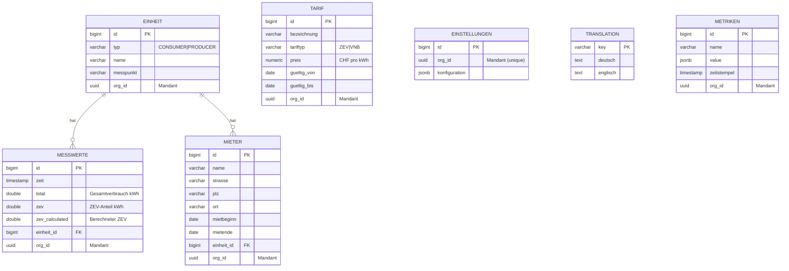

# CLAUDE.md

This file provides guidance to Claude Code (claude.ai/code) when working with code in this repository.

## Project Overview

ZEV (Zusammenschluss zum Eigenverbrauch) is a solar power distribution application for managing fair allocation of solar energy among consumers in a self-consumption community. Multi-module Maven project with Spring Boot backend, Angular frontend, and Keycloak authentication.

## Prerequisites

- Java 21
- Maven 3.6+
- Node.js 20.19.0+
- Docker & Docker Compose

## Tech Stack Versions

### Core
- Spring Boot 4.0.1
- Angular 21.1.0
- TypeScript 5.9.3
- PostgreSQL 16 (Alpine)

### Key Backend Dependencies
- JasperReports 7.0.3 (Jakarta EE, PDF generation)
- Swiss QR Bill Generator 3.3.0 (payment slips)
- Spring AI Anthropic 2.0.0-M1 (model: `claude-haiku-4-5-20251001`)
- Caffeine (in-memory cache)
- Spring Boot Admin 4.0.0-M1
- Flyway (schema migrations)

### Key Frontend Dependencies
- Chart.js 4.5.1 (data visualization)
- keycloak-angular ^21.0.0 / keycloak-js ^25.0.0

### Testing
- Playwright 1.58.0 (E2E tests)
- Jasmine 5.13.0 / Karma (unit tests)
- TestContainers 2.0.3 (integration tests)
- ArchUnit 1.3.0 (architecture tests)

## Build & Test Commands

### Full Stack
```bash
# Build all modules with tests
mvn clean compile test

# Build with integration tests
mvn clean compile test verify

# Start entire stack (PostgreSQL, Keycloak, all services)
docker-compose up --build
```

### Backend Service
```bash
cd backend-service

# Unit tests only (Surefire)
mvn test

# Integration tests (Failsafe, uses TestContainers)
mvn verify

# Run single test class
mvn test -Dtest=EinheitServiceTest

# Run single test method
mvn test -Dtest=EinheitServiceTest#testGetAllEinheiten

# Tests zur Prüfung ob die Jasper Reports kompiliert werden können
mvn test -Dtest=JasperTemplateCompileTest
```

### Frontend Service
```bash
cd frontend-service

npm install
npm start           # Dev server at localhost:4200
npm test            # Unit tests (Jasmine/Karma)
npm run e2e         # Playwright E2E tests
npm run e2e:ui      # Playwright interactive mode
```

### Design System
```bash
cd design-system

npm install
npm run build       # Build CSS + TypeScript
npm run watch       # Watch mode for development
```

### Admin Service
```bash
cd admin-service

# Build
mvn clean compile

# Run tests
mvn test
```

## Architecture

```
┌─────────────────┐     ┌─────────────────┐     ┌─────────────────┐
│ frontend-service│────▶│ backend-service │────▶│  admin-service  │
│   (Angular 21)  │     │ (Spring Boot)   │     │ (Spring Boot)   │
└────────┬────────┘     └────────┬────────┘     └─────────────────┘
         │                       │
         ▼                       ▼
┌─────────────────┐     ┌─────────────────┐
│    Keycloak     │     │   PostgreSQL    │
│   (OAuth2/JWT)  │     │     (zev DB)    │
└─────────────────┘     └─────────────────┘

┌─────────────────┐     ┌─────────────────┐
│   Prometheus    │────▶│     Grafana     │
│   (Metrics)     │     │  (Dashboards)   │
└─────────────────┘     └─────────────────┘
```

**Backend Layers:** Controller → Service → Repository → Entity

**Backend Package Structure:** `backend-service/src/main/java/ch/nacht/`
- `config/` - SecurityConfig, CacheConfig, WebMvcConfig, OrganizationInterceptor
- `controller/` - REST controllers (see API Endpoints below)
- `dto/` - Data transfer objects (StatistikDTO, RechnungDTO, EinheitMatchRequestDTO, etc.)
- `entity/` - JPA entities + enums (EinheitTyp, TarifTyp)
- `exception/` - GlobalExceptionHandler, NoOrganizationException
- `repository/` - Spring Data JPA repositories
- `service/` - Business logic (15 services)
- `util/` - BarImageHelper (PDF bar chart generation)

### REST API Endpoints

| Controller | Base Path | Auth |
|------------|-----------|------|
| EinheitController | `/api/einheit` | zev |
| MesswerteController | `/api/messwerte` | zev |
| TranslationController | `/api/translations` | zev |
| TarifController | `/api/tarife` | zev_admin |
| MieterController | `/api/mieter` | zev_admin |
| EinstellungenController | `/api/einstellungen` | zev_admin |
| RechnungController | `/api/rechnungen` | zev_admin |
| StatistikController | `/api/statistik` | zev |
| PingController | `/ping` | public |

**Key Backend Components:**
- `EinheitController` - CRUD for units (consumers/producers)
- `MesswerteController` - Measurement data upload/retrieval
- `TranslationController` - i18n support
- `TarifController` - Tariff management
- `MieterController` - Tenant (Mieter) management
- `EinstellungenController` - Tenant-specific settings
- `RechnungController` - Invoice generation and PDF download
- `StatistikController` - Statistics and PDF export
- `PingController` - Health check
- `SolarDistribution.java` - Core fair distribution algorithm (equal shares)
- `ProportionalConsumptionDistribution.java` - Alternative proportional distribution algorithm (higher consumers get proportionally more)
- `RechnungPdfService` / `StatistikPdfService` - JasperReports PDF generation
- `EinheitMatchingService` - AI-powered unit matching for CSV uploads
- `SecurityConfig` - OAuth2 JWT validation with Keycloak
- Multi-tenant support via Keycloak organization claim (`OrganizationContextService`, `HibernateFilterService`)
- Caffeine cache for `statistik` (TTL: 15 min, max: 100 entries)

**JasperReports Templates:** `backend-service/src/main/resources/reports/`
- `rechnung.jrxml` - Invoice PDF
- `statistik.jrxml` - Statistics PDF
- `einheit-summen.jrxml` - Unit summary subreport

**Admin Service:**
- Spring Boot Admin monitoring dashboard
- Runs on port 8081

**Key Frontend Components:**
- `StartseiteComponent` - Homepage / landing page
- `EinheitListComponent` / `EinheitFormComponent` - Unit management
- `MieterListComponent` / `MieterFormComponent` - Tenant management
- `MesswerteUploadComponent` - CSV upload with AI matching
- `MesswerteChartComponent` - Chart visualization
- `SolarCalculationComponent` - Distribution calculator
- `RechnungenComponent` - Invoice generation and download
- `StatistikComponent` - Statistics and reporting
- `TarifListComponent` / `TarifFormComponent` - Tariff management
- `EinstellungenComponent` - Tenant-specific settings
- `TranslationEditorComponent` - Admin translation management
- `QuarterSelectorComponent` - Quarterly period selector
- `NavigationComponent` - Main navigation (hamburger menu)
- `KebabMenuComponent` - Row action menu
- `IconComponent` - Feather Icons integration
- `DesignSystemShowcaseComponent` - Design system demo page

**Shared Frontend Utilities:**
- `SwissDatePipe` - Formats dates to Swiss format (dd.MM.yyyy)
- `TranslatePipe` - i18n translation pipe
- `ColumnResizeDirective` - Resizable table columns with drag & auto-fit
- `date-utils.ts` - Date formatting/parsing utilities (`formatSwissDate`, `parseSwissDate`)
- `ErrorInterceptor` - Global HTTP error handling (logs out on NO_ORGANIZATION 403)

### Frontend Routes & Roles

| Route | Component | Roles |
|-------|-----------|-------|
| `/startseite` | StartseiteComponent | zev, zev_admin |
| `/upload` | MesswerteUploadComponent | zev, zev_admin |
| `/einheiten` | EinheitListComponent | zev, zev_admin |
| `/solar-calculation` | SolarCalculationComponent | zev, zev_admin |
| `/chart` | MesswerteChartComponent | zev |
| `/statistik` | StatistikComponent | zev |
| `/rechnungen` | RechnungenComponent | zev_admin |
| `/tarife` | TarifListComponent | zev_admin |
| `/mieter` | MieterListComponent | zev_admin |
| `/einstellungen` | EinstellungenComponent | zev_admin |
| `/translations` | TranslationEditorComponent | zev_admin |
| `/design-system` | DesignSystemShowcaseComponent | zev |

## Key Conventions

### Testing Strategy
- Unit tests: `*Test.java` (backend), `*.spec.ts` (frontend)
- Integration tests: `*IT.java` with TestContainers
- E2E tests: Playwright in `frontend-service/tests/`
- Architecture tests: ArchUnit in `ArchitectureTest.java`
- Follow test pyramid: 70-80% unit, 15-20% integration, 5-10% E2E

**Backend Test Infrastructure:**
- `AbstractIntegrationTest` - Base class with singleton PostgreSQL TestContainer (postgres:16-alpine), auto-configures datasource, enables Flyway
- `JasperTemplateCompileTest` - Verifies all JasperReports templates compile

**Playwright Configuration:**
- Browsers: Chromium, Firefox
- Retries: 3, Workers: 4 (local) / 1 (CI)
- Trace: on-first-retry
- Base URL: http://localhost:4200

### Database
- Flyway migrations in `backend-service/src/main/resources/db/migration/`
- Migration naming: `V[number]__[description].sql`
- Schema: `zev` (application), `keycloak` (identity)

#### Entity Relationship Diagram



### Internationalization
- All UI text via `TranslationService` (not hardcoded)
- Translations stored in database
- Use `TranslatePipe` in Angular templates

### Authentication
- Keycloak roles: `zev` (member), `zev_admin` (admin), `user` (basic)
- Backend: `@PreAuthorize` annotations for authorization
- Frontend: `AuthGuard` for route protection

### Design System
- Use `@zev/design-system` for UI components (local workspace dependency)
- Design tokens in `design-system/src/tokens/` (colors, spacing, typography, shadows, transitions)
- CSS components: button, card, checkbox, collapsible, container, drop-zone, form, icon, kebab-menu, message, navigation (navbar), panel, quarter-selector, spinner, statistik, status, table, typography

## Code-Vorlagen für deterministische Generierung

Bei der Code-Generierung diese Dateien als Vorlage verwenden und deren Struktur exakt übernehmen:

### Backend

| Neuer Code | Vorlage |
|------------|---------|
| Entity | `backend-service/src/main/java/ch/nacht/entity/Tarif.java` |
| Repository | `backend-service/src/main/java/ch/nacht/repository/TarifRepository.java` |
| Service | `backend-service/src/main/java/ch/nacht/service/TarifService.java` |
| Controller | `backend-service/src/main/java/ch/nacht/controller/TarifController.java` |
| Service Test | `backend-service/src/test/java/ch/nacht/service/TarifServiceTest.java` |
| Controller Test | `backend-service/src/test/java/ch/nacht/controller/TarifControllerTest.java` |

### Frontend

| Neuer Code | Vorlage |
|------------|---------|
| Model | `frontend-service/src/app/models/tarif.model.ts` |
| Service | `frontend-service/src/app/services/tarif.service.ts` |
| List-Component | `frontend-service/src/app/components/tarif-list/` |
| Form-Component | `frontend-service/src/app/components/tarif-form/` |
| Directive | `frontend-service/src/app/directives/column-resize.directive.ts` |
| Pipe | `frontend-service/src/app/pipes/swiss-date.pipe.ts` |
| Utility | `frontend-service/src/app/utils/date-utils.ts` |
| Service Unit Test | `frontend-service/src/app/services/tarif.service.spec.ts` |
| Component Unit Test | `frontend-service/src/app/components/tarif-form/tarif-form.component.spec.ts` |
| Directive Unit Test | `frontend-service/src/app/directives/column-resize.directive.spec.ts` |
| Pipe Unit Test | `frontend-service/src/app/pipes/swiss-date.pipe.spec.ts` |
| E2E Test | `frontend-service/tests/tarif-verwaltung.spec.ts` |

### Umsetzungsplan

| Neuer Plan | Vorlage |
|------------|---------|
| Feature-Umsetzungsplan | `Specs/Tarifverwaltung_Umsetzungsplan.md` |

## Specifications

Feature specs are in `/Specs/`:
- `SPEC.md` - Template for new feature specifications
- `generell.md` - General requirements (i18n, design system, testing)
- `Mandantenfähigkeit.md` - Multi-tenancy implementation
- `Tarifverwaltung.md` - Tariff management
- `Tarifverwaltung-Tarif-kopieren.md` - Copy tariff functionality
- `TarifValidierung.md` - Tariff validation
- `Quartale.md` - Quarterly periods management
- `RechnungenGenerieren.md` - Invoice generation
- `Einzahlungsschein.md` - Payment slip (Swiss QR Bill)
- `Statistik.md` - Statistics and reporting
- `Metriken.md` - Prometheus metrics integration
- `Metriken-persistieren.md` - Metrics persistence
- `Metrik_mit_Label.md` - Metrics with labels
- `SpaltenbreiteVeränderbar.md` - Resizable table columns
- `Mieterverwaltung.md` - Tenant management
- `Einstellungen.md` - Settings
- `Startseite.md` - Homepage
- `Kebabmenü.md` - Kebab menu (row actions)
- `Hamburgermenü.md` - Hamburger menu (navigation)
- `Icons.md` - Icon system
- `DeleteTranslations.md` - Translation deletion
- `Messwerte-mit-KI.md` - AI-assisted measurement upload
- `MQTT-SmartMeter.md` - MQTT smart meter integration
- `RefactoringProducer.md` - Producer refactoring
- `SpringBoot4Upgrade.md` - Spring Boot 4 upgrade
- `Statistik-PDF_Summen-pro-Einheit_Umsetzungsplan.md` - Statistics PDF unit summaries

Specs with `_Umsetzungsplan` suffix contain implementation plans. Pure implementation plans (no separate spec):
- `PDF-Bibliothek-Wechsel_Umsetzungsplan.md` - PDF library switch
- `GCP-Deployment_Umsetzungsplan.md` - GCP deployment
- `SpringBoot4Upgrade_Umsetzungsplan.md` - Spring Boot 4 upgrade

## Documentation

Additional documentation in `/docs/`:
- `Anleitung-keycloak.md` - Keycloak configuration guide
- `claude-code-architektur.md` - Claude Code architecture
- `claude-code-zev-integration.md` - Claude Code ZEV integration
- `archunit-tests.md` - ArchUnit test documentation

## Docker Compose

**Services:**

| Service | Image / Build | Port | Notes |
|---------|--------------|------|-------|
| postgres | postgres:16-alpine | 5432 | DB: zev, User: postgres/postgres, healthcheck |
| keycloak | quay.io/keycloak/keycloak:latest | 9000 | Admin: admin/admin, uses postgres (schema: keycloak) |
| backend-service | ./backend-service | 8090 | Depends on postgres, admin-service |
| admin-service | ./admin-service | 8081 | Spring Boot Admin dashboard |
| frontend-service | ./frontend-service | 4200→8080 | Nginx, depends on backend + admin |
| prometheus | prom/prometheus:latest | 9090 | Scrapes backend, admin, frontend actuator |
| grafana | grafana/grafana:latest | 3000 | Admin: admin/admin, provisioned dashboards |

Network: `zev-network` (bridge)

**Environment:** Copy `.env.example` to `.env` and set `ANTHROPIC_API_KEY` for AI features.

## Access Points (Docker)

- Frontend: http://localhost:4200
- Backend API: http://localhost:8090
- Admin Service: http://localhost:8081
- Keycloak: http://localhost:9000
- Keycloak Admin: http://localhost:9000 (admin/admin)
- Prometheus: http://localhost:9090
- Grafana: http://localhost:3000 (admin/admin)

## Test Users (Keycloak)

- `testuser` / `testpassword` (zev_admin role)
- `user` / `password` (zev role)

## Database Access

Direct database access options:
- **MCP Server**: Use the `zev-db` MCP server for SQL queries
- **Docker**: `docker exec postgres psql -U postgres -d zev -c "SELECT ..."`

## AI Integration

The backend uses Spring AI Anthropic (2.0.0-M1) with model `claude-haiku-4-5-20251001` for AI-powered unit matching during CSV measurement upload (`EinheitMatchingService`). Configuration: max_tokens=100, temperature=0.0. Requires `ANTHROPIC_API_KEY` environment variable (see `.env.example`).
