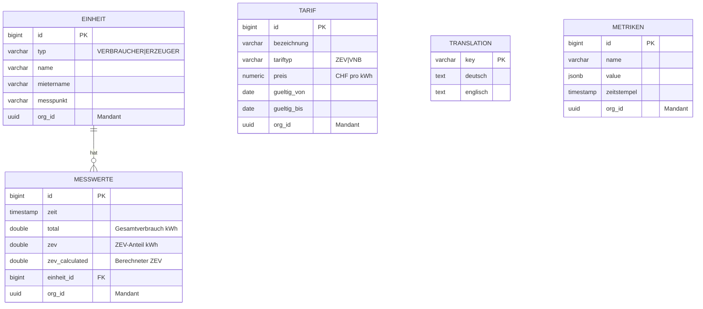

# CLAUDE.md

This file provides guidance to Claude Code (claude.ai/code) when working with code in this repository.

## Project Overview

ZEV (Zusammenschluss zum Eigenverbrauch) is a solar power distribution application for managing fair allocation of solar energy among consumers in a self-consumption community. Multi-module Maven project with Spring Boot backend, Angular frontend, and Keycloak authentication.

## Prerequisites

- Java 17+
- Maven 3.6+
- Node.js 20.19.0+
- Docker & Docker Compose

## Build & Test Commands

### Full Stack
```bash
# Build all modules with tests
mvn clean compile test

# Build with integration tests
mvn clean compile test verify

# Start entire stack (PostgreSQL, Keycloak, all services)
docker-compose up --build
```

### Backend Service
```bash
cd backend-service

# Unit tests only (Surefire)
mvn test

# Integration tests (Failsafe, uses TestContainers)
mvn verify

# Run single test class
mvn test -Dtest=EinheitServiceTest

# Run single test method
mvn test -Dtest=EinheitServiceTest#testGetAllEinheiten
```

### Frontend Service
```bash
cd frontend-service

npm install
npm start           # Dev server at localhost:4200
npm test            # Unit tests (Jasmine/Karma)
npm run e2e         # Playwright E2E tests
npm run e2e:ui      # Playwright interactive mode
```

### Design System
```bash
cd design-system

npm install
npm run build       # Build CSS + TypeScript
npm run watch       # Watch mode for development
```

### Admin Service
```bash
cd admin-service

# Build
mvn clean compile

# Run tests
mvn test
```

## Architecture

```
┌─────────────────┐     ┌─────────────────┐     ┌─────────────────┐
│ frontend-service│────▶│ backend-service │────▶│  admin-service  │
│   (Angular 21)  │     │ (Spring Boot)   │     │ (Spring Boot)   │
└────────┬────────┘     └────────┬────────┘     └─────────────────┘
         │                       │
         ▼                       ▼
┌─────────────────┐     ┌─────────────────┐
│    Keycloak     │     │   PostgreSQL    │
│   (OAuth2/JWT)  │     │     (zev DB)    │
└─────────────────┘     └─────────────────┘

┌─────────────────┐     ┌─────────────────┐
│   Prometheus    │────▶│     Grafana     │
│   (Metrics)     │     │  (Dashboards)   │
└─────────────────┘     └─────────────────┘
```

**Backend Layers:** Controller → Service → Repository → Entity

**Key Backend Components:**
- `EinheitController` - CRUD for units (consumers/producers)
- `MesswerteController` - Measurement data upload/retrieval
- `TranslationController` - i18n support
- `TarifController` - Tariff management
- `QuartalController` - Quarterly periods management
- `SolarDistribution.java` - Core fair distribution algorithm
- `SecurityConfig` - OAuth2 JWT validation with Keycloak
- Multi-tenant support via Keycloak organization claim

**Admin Service:**
- Separate Spring Boot service for admin operations
- Runs on port 8081

**Key Frontend Components:**
- `EinheitListComponent` / `EinheitFormComponent` - Unit management
- `MesswerteUploadComponent` - CSV upload
- `MesswerteChartComponent` - Chart visualization
- `SolarCalculationComponent` - Distribution calculator
- `TranslationEditorComponent` - Admin translation management
- `StatistikComponent` - Statistics and reporting

**Shared Frontend Utilities:**
- `SwissDatePipe` - Formats dates to Swiss format (dd.MM.yyyy)
- `TranslatePipe` - i18n translation pipe
- `ColumnResizeDirective` - Resizable table columns with drag & auto-fit
- `date-utils.ts` - Date formatting/parsing utilities (`formatSwissDate`, `parseSwissDate`)

## Key Conventions

### Testing Strategy
- Unit tests: `*Test.java` (backend), `*.spec.ts` (frontend)
- Integration tests: `*IT.java` with TestContainers
- E2E tests: Playwright in `frontend-service/tests/`
- Follow test pyramid: 70-80% unit, 15-20% integration, 5-10% E2E

### Database
- Flyway migrations in `backend-service/src/main/resources/db/migration/`
- Migration naming: `V[number]__[description].sql`
- Schema: `zev` (application), `keycloak` (identity)

#### Entity Relationship Diagram



### Internationalization
- All UI text via `TranslationService` (not hardcoded)
- Translations stored in database
- Use `TranslatePipe` in Angular templates

### Authentication
- Keycloak roles: `zev` (member), `zev_admin` (admin), `user` (basic)
- Backend: `@PreAuthorize` annotations for authorization
- Frontend: `AuthGuard` for route protection

### Design System
- Use `@zev/design-system` for UI components
- Design tokens in `design-system/src/tokens/`
- Components: Button, Navigation, Card

## Code-Vorlagen für deterministische Generierung

Bei der Code-Generierung diese Dateien als Vorlage verwenden und deren Struktur exakt übernehmen:

### Backend

| Neuer Code | Vorlage |
|------------|---------|
| Entity | `backend-service/src/main/java/ch/nacht/entity/Tarif.java` |
| Repository | `backend-service/src/main/java/ch/nacht/repository/TarifRepository.java` |
| Service | `backend-service/src/main/java/ch/nacht/service/TarifService.java` |
| Controller | `backend-service/src/main/java/ch/nacht/controller/TarifController.java` |
| Service Test | `backend-service/src/test/java/ch/nacht/service/TarifServiceTest.java` |
| Controller Test | `backend-service/src/test/java/ch/nacht/controller/TarifControllerTest.java` |

### Frontend

| Neuer Code | Vorlage |
|------------|---------|
| Model | `frontend-service/src/app/models/tarif.model.ts` |
| Service | `frontend-service/src/app/services/tarif.service.ts` |
| List-Component | `frontend-service/src/app/components/tarif-list/` |
| Form-Component | `frontend-service/src/app/components/tarif-form/` |
| Directive | `frontend-service/src/app/directives/column-resize.directive.ts` |
| Pipe | `frontend-service/src/app/pipes/swiss-date.pipe.ts` |
| Utility | `frontend-service/src/app/utils/date-utils.ts` |
| Service Unit Test | `frontend-service/src/app/services/tarif.service.spec.ts` |
| Component Unit Test | `frontend-service/src/app/components/tarif-form/tarif-form.component.spec.ts` |
| Directive Unit Test | `frontend-service/src/app/directives/column-resize.directive.spec.ts` |
| Pipe Unit Test | `frontend-service/src/app/pipes/swiss-date.pipe.spec.ts` |
| E2E Test | `frontend-service/tests/tarif-verwaltung.spec.ts` |

### Umsetzungsplan

| Neuer Plan | Vorlage |
|------------|---------|
| Feature-Umsetzungsplan | `Specs/Tarifverwaltung_Umsetzungsplan.md` |

## Specifications

Feature specs are in `/Specs/`:
- `SPEC.md` - Template for new feature specifications
- `generell.md` - General requirements (i18n, design system, testing)
- `Mandantenfähigkeit.md` - Multi-tenancy implementation
- `Tarifverwaltung.md` - Tariff management
- `Quartale.md` - Quarterly periods management
- `RechnungenGenerieren.md` - Invoice generation
- `Statistik.md` - Statistics and reporting
- `Metriken.md` - Prometheus metrics integration
- `SpaltenbreiteVeränderbar.md` - Resizable table columns
- `Anleitung-keycloak.md` - Keycloak configuration guide

Specs with `_Umsetzungsplan` suffix contain implementation plans.

## Access Points (Docker)

- Frontend: http://localhost:4200
- Backend API: http://localhost:8090
- Admin Service: http://localhost:8081
- Keycloak: http://localhost:9000
- Keycloak Admin: http://localhost:9000 (admin/admin)
- Prometheus: http://localhost:9090
- Grafana: http://localhost:3000 (admin/admin)

## Test Users (Keycloak)

- `testuser` / `testpassword` (zev_admin role)
- `user` / `password` (zev role)

## Database Access

Direct database access options:
- **MCP Server**: Use the `zev-db` MCP server for SQL queries
- **Docker**: `docker exec postgres psql -U postgres -d zev -c "SELECT ..."`

## AI Integration

The backend uses Spring AI with Anthropic Claude for AI-powered features (e.g., unit matching during measurement upload). Requires `ANTHROPIC_API_KEY` environment variable.
