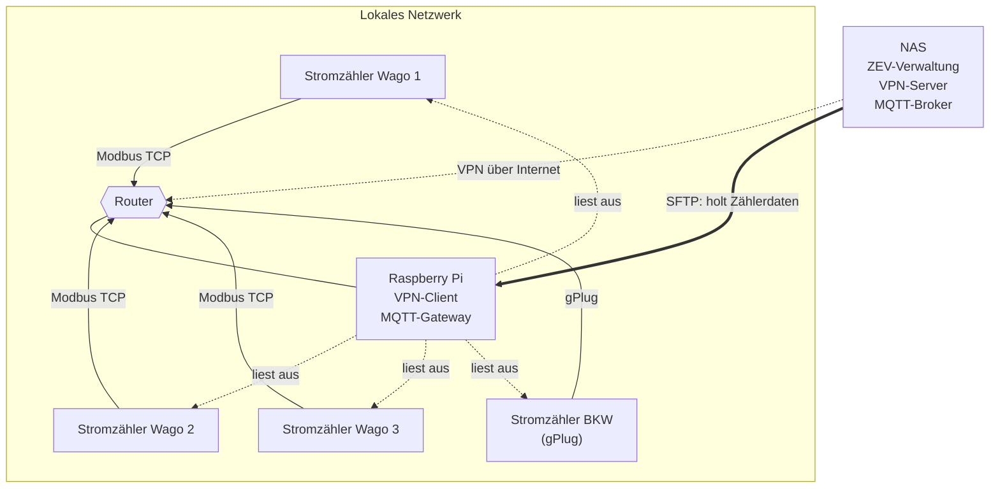

# Netzwerk-Topologie ZEV



## Setup-Notiz: Dateiübertragung via SFTP

Das NAS holt die Zählerdaten-Dateien aktiv beim Raspberry Pi ab (Pull). Als
Übertragungsweg wird **SFTP** (über SSH) verwendet — die sichere Variante
gegenüber Samba/SMB: Verschlüsselung ist immer aktiv, schlüsselbasierte
Authentisierung, nur ein offener Port (22), kleine Angriffsfläche. Zusätzlich
zum VPN-Tunnel ergibt das Defense-in-Depth.

### Empfohlene Härtung

1. **SSH-Key-Auth statt Passwort**: Public Key des NAS auf den Pi hinterlegen,
   Passwort-Login deaktivieren.
   ```
   # /etc/ssh/sshd_config auf dem Raspberry Pi
   PasswordAuthentication no
   PubkeyAuthentication yes
   ```
2. **Dedizierter, eingeschränkter User** auf dem Pi nur für den Datenabzug
   (z. B. `zevdata`), nicht der Standard-User.
3. **Auf SFTP einsperren** (Chroot, kein Shell-Zugriff aufs restliche System):
   ```
   # /etc/ssh/sshd_config auf dem Raspberry Pi
   Match User zevdata
       ForceCommand internal-sftp
       ChrootDirectory /srv/zev-export
       AllowTcpForwarding no
       X11Forwarding no
   ```
4. **Read-only**: Das NAS holt nur ab und schreibt nicht zurück; das
   Export-Verzeichnis für `zevdata` entsprechend berechtigen.

### Abholen vom NAS (Beispiel)

Effizient inkrementell mit `rsync` über SSH (überträgt nur geänderte Dateien) —
selbes Sicherheitsniveau wie SFTP, da derselbe SSH-Transport genutzt wird:

```bash
rsync -avz --remove-source-files \
  -e "ssh -i /volume1/keys/zev_id_ed25519" \
  zevdata@<raspberry-pi-vpn-ip>:/srv/zev-export/ \
  /volume1/zev-import/
```

Alternativ rein mit SFTP:

```bash
sftp -i /volume1/keys/zev_id_ed25519 zevdata@<raspberry-pi-vpn-ip>
```

Der Abruf wird am NAS per Cronjob/geplanter Aufgabe periodisch ausgeführt.

## Verbesserungspotenzial der Architektur

Die aktuelle Architektur (file-basiertes SFTP-Staging) ist bewusst entkoppelt,
fehlertolerant und einfach zu debuggen. Folgende Punkte erhöhen Sicherheit,
Reichbarkeit und Datenqualität — geordnet nach Wirkung.

### 1. VPN-Richtung umdrehen: Pi als Client statt Server

Aktuell ist der Pi der VPN-Server → der Router am Zählerstandort muss aus dem
Internet erreichbar sein (Port-Forwarding + DynDNS). Das ist das größte Risiko:

- **CGNAT-Problem**: Viele ISPs vergeben kein öffentlich erreichbares IPv4 mehr
  → eingehendes VPN funktioniert dann gar nicht.
- **Angriffsfläche**: Ein aus dem Internet erreichbarer offener Port am
  Wohnstandort.

**Besser**: Der Pi wählt sich *ausgehend* beim NAS (oder einem kleinen
Cloud-Endpoint) als VPN-**Client** ein. Der Tunnel ist danach bidirektional —
das NAS kann weiterhin per SFTP *ziehen*. Vorteile: kein Port-Forwarding,
CGNAT-tauglich, keine Inbound-Exposition am Zählerstandort. WireGuard eignet
sich dafür ideal (schlank, läuft gut auf dem Pi).

### 2. Netzwerk-Segmentierung für die Zähler

Modbus TCP ist **unverschlüsselt und ohne Authentisierung**. Aktuell hängen
Zähler, Pi und der VPN-Pfad im selben flachen LAN; ein kompromittiertes Gerät
erreicht alles.

→ Zähler in ein eigenes VLAN / separates Netzsegment legen; nur der Pi darf per
Modbus dorthin. Trennt OT (Zähler) von IT (Pi/NAS-Pfad).

### 3. Datenpipeline härten (Korrektheit)

- **Atomare Dateiübergabe**: Pi schreibt in `*.tmp` und benennt erst nach
  vollständigem Schreiben um (`rename`), sonst liest das NAS evtl. halbe
  Dateien. `rsync --remove-source-files` löscht erst nach erfolgreicher
  Übertragung.
- **Pi-Speicher**: Nicht auf die SD-Karte schreiben (Wear-out → Datenverlust).
  USB-SSD oder zumindest Log-Rotation + ausreichend Puffer, damit ein
  NAS-Ausfall überbrückt wird.
- **NTP auf dem Pi**: Zählerwerte brauchen korrekte Zeitstempel — eine driftende
  Pi-Uhr verfälscht die ganze ZEV-Abrechnung.

### 4. Monitoring gegen stillen Ausfall

Heute merkt niemand, wenn der Pi nicht mehr ausliest oder das NAS nicht mehr
importiert → stiller Datenverlust, der erst bei der Quartalsabrechnung auffällt.
ZEV hat bereits **Prometheus/Grafana** im Stack: Pi einen Heartbeat bzw.
„letzter erfolgreicher Read"-Timestamp exponieren lassen und Alert bei Lücke.

### Strategische Alternative: MQTT (Trade-off, kein Muss)

Statt File-Batch + SFTP könnte der **Pi als MQTT-Gateway** die Messwerte an
einen Broker beim NAS publizieren, ZEV abonniert sie (siehe Spec
`MQTT-SmartMeter.md`) → näher an Echtzeit, kein Datei-Handling. Alternativ
direkter Push des Pi an die bestehende `/api/messwerte`-REST-Schnittstelle.

**Empfehlung**: Das jetzige File/SFTP-Modell vorerst behalten (entkoppelt,
fehlertolerant, einfach zu debuggen) und Punkte 1–4 umsetzen. MQTT erst, wenn
Echtzeit oder deutlich mehr Zähler tatsächlich gefordert sind — sonst
zusätzliche Komplexität (Broker-Betrieb, Verfügbarkeit) ohne klaren Nutzen.

## Setup-Notiz: MQTT-Broker auf dem NAS betreiben

Für die MQTT-Variante (s. o.) wird ein Broker auf dem NAS benötigt. Empfohlen:
**Eclipse Mosquitto im Docker-Container** (auf Synology: Container Manager).
Mosquitto ist der De-facto-Standard — schlank, stabil, NAS-tauglich. Docker gibt
gegenüber einem NAS-Paket volle Versions- und Konfigurationskontrolle.

### 1. Verzeichnisstruktur auf dem NAS

```
/volume1/docker/mosquitto/
├── config/   → mosquitto.conf, passwordfile
├── data/     → persistente Nachrichten (Retained Messages)
└── log/
```

### 2. mosquitto.conf

```conf
# /volume1/docker/mosquitto/config/mosquitto.conf
listener 1883
persistence true
persistence_location /mosquitto/data/
log_dest file /mosquitto/log/mosquitto.log

# Keine anonymen Verbindungen!
allow_anonymous false
password_file /mosquitto/config/passwordfile
```

### 3. docker-compose (Container Manager → Projekt)

```yaml
services:
  mosquitto:
    image: eclipse-mosquitto:2
    container_name: mosquitto
    restart: unless-stopped
    ports:
      - "1883:1883"     # MQTT (intern / über VPN)
      - "8883:8883"     # MQTT über TLS (empfohlen)
    volumes:
      - /volume1/docker/mosquitto/config:/mosquitto/config
      - /volume1/docker/mosquitto/data:/mosquitto/data
      - /volume1/docker/mosquitto/log:/mosquitto/log
```

### 4. Benutzer/Passwort anlegen

```bash
# im laufenden Container
docker exec -it mosquitto mosquitto_passwd -c /mosquitto/config/passwordfile zevpi
# danach Broker neu starten, damit die Datei geladen wird
```

Getrennte User anlegen: einen für den **Pi (Publisher)** und einen für die
**ZEV-Verwaltung (Subscriber)**.

### Sicherheit

- **`allow_anonymous false`** + Passwort ist Pflicht — sonst kann jeder im Netz
  publizieren/mitlesen.
- **TLS (Port 8883)**: Auch über den VPN-Tunnel zusätzlich per TLS absichern
  (Defense-in-Depth). Zertifikate ins `config/`-Verzeichnis und in
  `mosquitto.conf` den `listener 8883` mit `cafile`/`certfile`/`keyfile`
  ergänzen.
- **ACLs**: Mit einer `acl_file` festlegen, dass der Pi nur in
  `zev/messwerte/#` publizieren und ZEV nur dort lesen darf.
- **Firewall**: Port 1883/8883 nur über den VPN-Pfad zugänglich machen, nicht
  ins offene Internet.

### Einordnung in die ZEV-Architektur

```
Pi (MQTT-Publisher) ──VPN──> NAS:1883/8883 (Mosquitto) ──> ZEV-Backend (Subscriber)
```

Das ZEV-Backend (Spring Boot) abonniert die Werte per MQTT-Client
(`spring-integration-mqtt` / Eclipse Paho) — das ist der Implementierungsteil aus
der Spec `MQTT-SmartMeter.md`.

**Verfügbarkeit beachten**: Anders als File/SFTP puffert MQTT nur begrenzt.
Fällt der Broker (NAS) aus, müssen Pi *und* Backend mit QoS 1/2 +
`persistence` + `clean_session false` arbeiten, damit keine Messwerte verloren
gehen — dies ist der zusätzliche Betriebsaufwand der MQTT-Variante.

### Wo läuft der Broker? — Varianten A/B/C

Technisch kann Mosquitto auf dem NAS *oder* dem Raspberry Pi laufen. Die Frage
ist nicht *ob*, sondern auf *welcher* Seite — es gibt drei sinnvolle Varianten.

#### Variante A — Broker auf dem Pi

```
Pi: Zähler-Reader → Broker (localhost)  ──VPN──>  NAS: ZEV-Backend (Subscriber)
```

- **Pro**: Publisher und Broker lokal → Publizieren funktioniert immer, auch bei
  VPN-/NAS-Ausfall. Der Broker puffert (persistence + QoS + retained) direkt an
  der Quelle (spiegelt die Resilienz des SFTP-Pull-Modells).
- **Contra**: Das NAS muss den Pi erreichen, um zu abonnieren → der für ZEV
  wichtige Konsument hängt an Pi + Tunnel. Zudem SD-Karten-Wear und geringere
  Uptime als ein NAS.

#### Variante B — Broker auf dem NAS (Empfehlung)

```
Pi: Zähler-Reader (Publisher)  ──VPN──>  NAS: Broker → ZEV-Backend (localhost)
```

- **Pro**: Der eigentliche Konsument (ZEV) verbindet sich lokal zum Broker →
  stabilste Verbindung dort, wo die Geschäftslogik läuft. NAS ist i. d. R. 24/7
  und robuster als der Pi. Pi bleibt schlank (nur Lesen + Publizieren).
- **Contra**: Fällt NAS oder VPN aus, schlägt das Publizieren fehl → der Pi
  braucht eigene Pufferung (siehe Variante C).

#### Variante C — Broker auf beiden, MQTT-Bridge (maximale Resilienz)

Ein lokaler Broker auf dem Pi nimmt die Messwerte entgegen und leitet sie per
Mosquitto-**Bridge** store-and-forward an den NAS-Broker weiter, sobald der
Tunnel steht.

```
Pi: Reader → lokaler Broker ──(Bridge/VPN)──> NAS-Broker → ZEV
```

- **Pro**: Vereint Pufferung an der Quelle *und* lokalen Konsumenten am NAS →
  kein Datenverlust bei VPN-/NAS-Ausfall.
- **Contra**: Zwei Broker = mehr Konfiguration und Betrieb. Für einen Standort
  mit einem Pi tendenziell Overkill.

#### Empfehlung

Für einen Standort mit einem Pi und einem NAS: **Variante B** — ZEV (Konsument)
dockt lokal und stabil an, NAS hat die höhere Uptime, Pi bleibt reiner
Publisher. Bei realem Datenverlustrisiko durch VPN-/NAS-Ausfälle auf
**Variante C** (Bridge auf dem Pi) nachrüsten. Variante A nur wählen, wenn der
Broker zusätzlich lokale Verbraucher *am Zählerstandort* bedienen soll.

