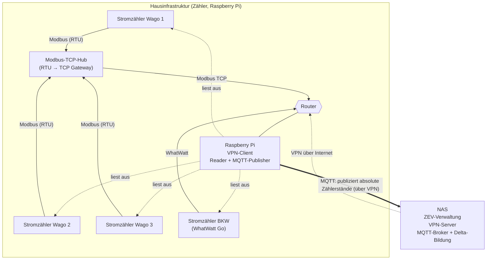

# Netzwerk-Topologie ZEV


```mermaid
flowchart TB
    subgraph Lokales_Netzwerk["Hausinfrastruktur (Zähler, Raspberry Pi)"]
        W1["Stromzähler Wago 1"]
        W2["Stromzähler Wago 2"]
        W3["Stromzähler Wago 3"]
        HUB["Modbus-TCP-Hub<br/>(RTU → TCP Gateway)"]
        BKW["Stromzähler BKW<br/>(WhatWatt Go)"]
        ROUTER{{"Router"}}
        RPI["Raspberry Pi<br/>VPN-Client<br/>Reader + MQTT-Publisher"]
    end

    NAS["NAS<br/>ZEV-Verwaltung<br/>VPN-Server<br/>MQTT-Broker + Delta-Bildung"]

    W1 -- "Modbus (RTU)" --> HUB
    W2 -- "Modbus (RTU)" --> HUB
    W3 -- "Modbus (RTU)" --> HUB
    HUB -- "Modbus TCP" --> ROUTER
    BKW -- "WhatWatt" --> ROUTER
    ROUTER --- RPI

    RPI -. "liest aus" .-> W1
    RPI -. "liest aus" .-> W2
    RPI -. "liest aus" .-> W3
    RPI -. "liest aus" .-> BKW

    NAS -. "VPN über Internet" .-> ROUTER
    RPI == "MQTT: publiziert absolute Zählerstände (über VPN)" ==> NAS
```

> **Zähler-Anbindung:** Die drei **Wago**-Zähler sind per **seriellem Modbus (RTU)** an einen
> **Modbus-TCP-Hub** (RTU→TCP-Gateway) angeschlossen, der am Router hängt; der Pi liest sie per
> **Modbus TCP** über den Hub (gemeinsame Hub-IP, je Zähler eine Unit-/Slave-ID). Der **BKW**-Zähler
> ist separat über **WhatWatt** am Router und kann ebenfalls per **Modbus TCP** ausgelesen werden.
>
> **Datenfluss (Ziel, MQTT):** Der Pi liest die Zähler (Modbus TCP über den Hub / WhatWatt) und
> **publiziert die absoluten Zählerstände** über den VPN-Tunnel an den
> Mosquitto-**Broker auf dem NAS** (Variante B). Das ZEV-Backend abonniert sie und
> **bildet die Deltas/15-Min-Werte** selbst — verlusttolerant (siehe
> `Specs/MQTT-Integration.md`). Der **SFTP-Pull** (NAS holt Dateien beim Pi) ist
> der heutige Weg bzw. Fallback.
>
> *Hinweis:* Das Diagramm zeigt den **Ziel-Pfad (MQTT)**. Der **SFTP-Pull** ist bewusst
> **nicht eingezeichnet** (der Übersichtlichkeit halber), bleibt aber als heutiger Weg/Fallback
> gültig — Details im Abschnitt „Setup-Notiz: Dateiübertragung via SFTP" unten.

## Setup-Notiz: Dateiübertragung via SFTP

Das NAS holt die Zählerdaten-Dateien aktiv beim Raspberry Pi ab (Pull). Als
Übertragungsweg wird **SFTP** (über SSH) verwendet — die sichere Variante
gegenüber Samba/SMB: Verschlüsselung ist immer aktiv, schlüsselbasierte
Authentisierung, nur ein offener Port (22), kleine Angriffsfläche. Zusätzlich
zum VPN-Tunnel ergibt das Defense-in-Depth.

### Empfohlene Härtung

1. **SSH-Key-Auth statt Passwort**: Public Key des NAS auf den Pi hinterlegen,
   Passwort-Login deaktivieren.
   ```
   # /etc/ssh/sshd_config auf dem Raspberry Pi
   PasswordAuthentication no
   PubkeyAuthentication yes
   ```
2. **Dedizierter, eingeschränkter User** auf dem Pi nur für den Datenabzug
   (z. B. `zevdata`), nicht der Standard-User.
3. **Auf SFTP einsperren** (Chroot, kein Shell-Zugriff aufs restliche System):
   ```
   # /etc/ssh/sshd_config auf dem Raspberry Pi
   Match User zevdata
       ForceCommand internal-sftp
       ChrootDirectory /srv/zev-export
       AllowTcpForwarding no
       X11Forwarding no
   ```
4. **Read-only**: Das NAS holt nur ab und schreibt nicht zurück; das
   Export-Verzeichnis für `zevdata` entsprechend berechtigen.

### Abholen vom NAS (Beispiel)

Effizient inkrementell mit `rsync` über SSH (überträgt nur geänderte Dateien) —
selbes Sicherheitsniveau wie SFTP, da derselbe SSH-Transport genutzt wird:

```bash
rsync -avz --remove-source-files \
  -e "ssh -i /volume1/keys/zev_id_ed25519" \
  zevdata@<raspberry-pi-vpn-ip>:/srv/zev-export/ \
  /volume1/zev-import/
```

Alternativ rein mit SFTP:

```bash
sftp -i /volume1/keys/zev_id_ed25519 zevdata@<raspberry-pi-vpn-ip>
```

Der Abruf wird am NAS per Cronjob/geplanter Aufgabe periodisch ausgeführt.

## Verbesserungspotenzial der Architektur

Die aktuelle Architektur (file-basiertes SFTP-Staging) ist bewusst entkoppelt,
fehlertolerant und einfach zu debuggen. Folgende Punkte erhöhen Sicherheit,
Reichbarkeit und Datenqualität — geordnet nach Wirkung.

### 1. VPN-Richtung umdrehen: Pi als Client statt Server

Aktuell ist der Pi der VPN-Server → der Router am Zählerstandort muss aus dem
Internet erreichbar sein (Port-Forwarding + DynDNS). Das ist das größte Risiko:

- **CGNAT-Problem**: Viele ISPs vergeben kein öffentlich erreichbares IPv4 mehr
  → eingehendes VPN funktioniert dann gar nicht.
- **Angriffsfläche**: Ein aus dem Internet erreichbarer offener Port am
  Wohnstandort.

**Besser**: Der Pi wählt sich *ausgehend* beim NAS (oder einem kleinen
Cloud-Endpoint) als VPN-**Client** ein. Der Tunnel ist danach bidirektional —
das NAS kann weiterhin per SFTP *ziehen*. Vorteile: kein Port-Forwarding,
CGNAT-tauglich, keine Inbound-Exposition am Zählerstandort. WireGuard eignet
sich dafür ideal (schlank, läuft gut auf dem Pi).

### 2. Netzwerk-Segmentierung für die Zähler

Modbus TCP ist **unverschlüsselt und ohne Authentisierung**. Aktuell hängen
Zähler, Pi und der VPN-Pfad im selben flachen LAN; ein kompromittiertes Gerät
erreicht alles.

→ Zähler in ein eigenes VLAN / separates Netzsegment legen; nur der Pi darf per
Modbus dorthin. Trennt OT (Zähler) von IT (Pi/NAS-Pfad).

### 3. Datenpipeline härten (Korrektheit)

- **Atomare Dateiübergabe**: Pi schreibt in `*.tmp` und benennt erst nach
  vollständigem Schreiben um (`rename`), sonst liest das NAS evtl. halbe
  Dateien. `rsync --remove-source-files` löscht erst nach erfolgreicher
  Übertragung.
- **Pi-Speicher**: Nicht auf die SD-Karte schreiben (Wear-out → Datenverlust).
  USB-SSD oder zumindest Log-Rotation + ausreichend Puffer, damit ein
  NAS-Ausfall überbrückt wird.
- **NTP auf dem Pi**: Zählerwerte brauchen korrekte Zeitstempel — eine driftende
  Pi-Uhr verfälscht die ganze ZEV-Abrechnung.

### 4. Monitoring gegen stillen Ausfall

Heute merkt niemand, wenn der Pi nicht mehr ausliest oder das NAS nicht mehr
importiert → stiller Datenverlust, der erst bei der Quartalsabrechnung auffällt.
ZEV hat bereits **Prometheus/Grafana** im Stack: Pi einen Heartbeat bzw.
„letzter erfolgreicher Read"-Timestamp exponieren lassen und Alert bei Lücke.

### Strategische Alternative: MQTT (Trade-off, kein Muss)

Statt File-Batch + SFTP könnte der **Pi als MQTT-Gateway** die Messwerte an
einen Broker beim NAS publizieren, ZEV abonniert sie (siehe Spec
`MQTT-Integration.md`) → näher an Echtzeit, kein Datei-Handling. Alternativ
direkter Push des Pi an die bestehende `/api/messwerte`-REST-Schnittstelle.

> **Rollentrennung – der Broker liest keine Zähler:** Ein MQTT-Broker (Mosquitto)
> **verteilt nur Nachrichten** und spricht kein Modbus. Das Auslesen der Zähler
> (Modbus TCP / gPlug) übernimmt ein **separater Reader-/Publisher-Prozess** auf
> dem Pi, der die Werte an den Broker *publiziert*. „Pi als MQTT-Gateway" meint
> also zwei Komponenten:
> 1. **Reader/Publisher** – liest die Zähler aus und publiziert (immer nötig, in
>    jeder Variante; **nicht** Teil der Broker-Installation, separat zu
>    implementieren/betreiben).
> 2. **Broker** – nur bei Variante A/C lokal auf dem Pi; bei Variante B nur auf dem NAS.
>
> Der Reader publiziert an den Broker auf `localhost` (diese Verbindung fällt
> praktisch nie aus); das Verlustrisiko bei Ausfällen liegt allein auf der Strecke
> **Broker → NAS** (siehe Pufferung/QoS in den Broker-Setup-Notizen unten).

**Empfehlung**: Das jetzige File/SFTP-Modell vorerst behalten (entkoppelt,
fehlertolerant, einfach zu debuggen) und Punkte 1–4 umsetzen. MQTT erst, wenn
Echtzeit oder deutlich mehr Zähler tatsächlich gefordert sind — sonst
zusätzliche Komplexität (Broker-Betrieb, Verfügbarkeit) ohne klaren Nutzen.

## Setup-Notiz: MQTT-Broker auf dem NAS betreiben

Für die MQTT-Variante (s. o.) wird ein Broker auf dem NAS benötigt. Empfohlen:
**Eclipse Mosquitto im Docker-Container** (auf Synology: Container Manager).
Mosquitto ist der De-facto-Standard — schlank, stabil, NAS-tauglich. Docker gibt
gegenüber einem NAS-Paket volle Versions- und Konfigurationskontrolle.

https://github.com/sukesh-ak/setup-mosquitto-with-docker

### 1. Verzeichnisstruktur auf dem NAS

```
/volume1/docker/mosquitto/
├── config/   → mosquitto.conf, passwordfile
├── data/     → persistente Nachrichten (Retained Messages)
└── log/
```

### 2. mosquitto.conf

```conf
# /volume1/docker/mosquitto/config/mosquitto.conf
listener 1883
persistence true
persistence_location /mosquitto/data/
log_dest file /mosquitto/log/mosquitto.log

# Keine anonymen Verbindungen!
allow_anonymous false
password_file /mosquitto/config/passwordfile
```

### 3. docker-compose (Container Manager → Projekt)

```yaml
services:
  mosquitto:
    image: eclipse-mosquitto:2
    container_name: mosquitto
    restart: unless-stopped
    ports:
      - "1883:1883"     # MQTT (intern / über VPN)
      - "8883:8883"     # MQTT über TLS (empfohlen)
    volumes:
      - /volume1/docker/mosquitto/config:/mosquitto/config
      - /volume1/docker/mosquitto/data:/mosquitto/data
      - /volume1/docker/mosquitto/log:/mosquitto/log
```

### 4. Benutzer/Passwort anlegen

```bash
# im laufenden Container
docker exec -it mosquitto mosquitto_passwd -c /mosquitto/config/passwordfile zevpi
# danach Broker neu starten, damit die Datei geladen wird
```

Getrennte User anlegen: einen für den **Pi (Publisher)** und einen für die
**ZEV-Verwaltung (Subscriber)**.

### Sicherheit

- **`allow_anonymous false`** + Passwort ist Pflicht — sonst kann jeder im Netz
  publizieren/mitlesen.
- **TLS (Port 8883)**: Auch über den VPN-Tunnel zusätzlich per TLS absichern
  (Defense-in-Depth). Zertifikate ins `config/`-Verzeichnis und in
  `mosquitto.conf` den `listener 8883` mit `cafile`/`certfile`/`keyfile`
  ergänzen.
- **ACLs**: Mit einer `acl_file` festlegen, dass der Pi nur in
  `zev/messwerte/#` publizieren und ZEV nur dort lesen darf.
- **Firewall**: Port 1883/8883 nur über den VPN-Pfad zugänglich machen, nicht
  im offenen LAN und nicht aus dem Internet erreichbar.

### Einordnung in die ZEV-Architektur

```
Pi (MQTT-Publisher) ──VPN──> NAS:1883/8883 (Mosquitto) ──> ZEV-Backend (Subscriber)
```

Das ZEV-Backend (Spring Boot) abonniert die Werte per MQTT-Client
(`spring-integration-mqtt` / Eclipse Paho) — das ist der Implementierungsteil aus
der Spec `MQTT-Integration.md`.

**Verfügbarkeit / Verlusttoleranz**: Gemäss `MQTT-Integration.md` überträgt der Pi
**absolute Zählerstände** (nicht Deltas), die Delta-Bildung macht das Backend.
Dadurch ist ein Nachrichtenverlust **unkritisch**: Fällt Broker/VPN kurz aus,
schliesst der nächste übertragene Stand die Lücke, die Gesamtsumme bleibt korrekt
(nur die zeitliche Auflösung sinkt kurz). Der frühere MQTT-Nachteil („puffert nur
begrenzt" → QoS 1/2 + `persistence` + `clean_session false` nötig) entfällt damit
weitgehend — **QoS 0/1 genügt**, ein Store-and-Forward-Puffer ist optional.

### Wo läuft der Broker? — Varianten A/B/C

Technisch kann Mosquitto auf dem NAS *oder* dem Raspberry Pi laufen. Die Frage
ist nicht *ob*, sondern auf *welcher* Seite — es gibt drei sinnvolle Varianten.

#### Variante A — Broker auf dem Pi

```
Pi: Zähler-Reader → Broker (localhost)  ──VPN──>  NAS: ZEV-Backend (Subscriber)
```

- **Pro**: Publisher und Broker lokal → Publizieren funktioniert immer, auch bei
  VPN-/NAS-Ausfall. Der Broker puffert (persistence + QoS + retained) direkt an
  der Quelle (spiegelt die Resilienz des SFTP-Pull-Modells).
- **Contra**: Das NAS muss den Pi erreichen, um zu abonnieren → der für ZEV
  wichtige Konsument hängt an Pi + Tunnel. Zudem SD-Karten-Wear und geringere
  Uptime als ein NAS.

#### Variante B — Broker auf dem NAS (Empfehlung)

```
Pi: Zähler-Reader (Publisher)  ──VPN──>  NAS: Broker → ZEV-Backend (localhost)
```

- **Pro**: Der eigentliche Konsument (ZEV) verbindet sich lokal zum Broker →
  stabilste Verbindung dort, wo die Geschäftslogik läuft. NAS ist i. d. R. 24/7
  und robuster als der Pi. Pi bleibt schlank (nur Lesen + Publizieren).
- **Contra**: Fällt NAS oder VPN aus, schlägt das Publizieren fehl → der Pi
  braucht eigene Pufferung (siehe Variante C).

#### Variante C — Broker auf beiden, MQTT-Bridge (maximale Resilienz)

Ein lokaler Broker auf dem Pi nimmt die Messwerte entgegen und leitet sie per
Mosquitto-**Bridge** store-and-forward an den NAS-Broker weiter, sobald der
Tunnel steht.

```
Pi: Reader → lokaler Broker ──(Bridge/VPN)──> NAS-Broker → ZEV
```

- **Pro**: Vereint Pufferung an der Quelle *und* lokalen Konsumenten am NAS →
  kein Datenverlust bei VPN-/NAS-Ausfall.
- **Contra**: Zwei Broker = mehr Konfiguration und Betrieb. Für einen Standort
  mit einem Pi tendenziell Overkill.

#### Empfehlung

Für einen Standort mit einem Pi und einem NAS: **Variante B** — ZEV (Konsument)
dockt lokal und stabil an, NAS hat die höhere Uptime, Pi bleibt reiner
Publisher. Da absolute Zählerstände verlusttolerant sind (s. o.), genügt
Variante B; **Variante C** (Bridge auf dem Pi) ist **kein Muss** und nur sinnvoll,
wenn auch die *zeitliche Auflösung* während Ausfällen lückenlos bleiben soll —
nicht zur Vermeidung von Datenverlust. Variante A nur wählen, wenn der
Broker zusätzlich lokale Verbraucher *am Zählerstandort* bedienen soll.

## Setup-Notiz: MQTT-Broker auf dem Raspberry Pi betreiben (Variante A / C)

Wird nur für **Variante A** (Broker läuft am Zählerstandort) oder als lokale
Hälfte von **Variante C** (Pi-Broker mit Bridge zum NAS) benötigt. Bei der
Standard-Empfehlung (Variante B, Broker nur auf dem NAS) ist dies **nicht** nötig.

Auf dem Pi ist die **native Installation via apt** am schlanksten (systemd,
kein Docker-Overhead). Falls auf dem Pi ohnehin Docker läuft (vgl.
`docs/NAS-Images.md`), geht auch `eclipse-mosquitto:2` analog zur NAS-Anleitung.

### 1. Installation (nativ, empfohlen)

```bash
sudo apt update
sudo apt install -y mosquitto mosquitto-clients
sudo systemctl enable --now mosquitto     # Autostart nach Reboot/Stromausfall
```

Pfade auf dem Pi (Raspberry Pi OS / Debian):
- Konfig: `/etc/mosquitto/mosquitto.conf` + `/etc/mosquitto/conf.d/*.conf`
- Daten (Persistence): `/var/lib/mosquitto/`
- Logs: `/var/log/mosquitto/`

### 2. Konfiguration

```conf
# /etc/mosquitto/conf.d/zev.conf
listener 1883
persistence true
persistence_location /var/lib/mosquitto/
autosave_interval 300            # seltener auf Disk schreiben (SD-Karten schonen)
log_dest file /var/log/mosquitto/mosquitto.log

# Keine anonymen Verbindungen!
allow_anonymous false
password_file /etc/mosquitto/passwd
```

> **SD-Karten-Wear:** `persistence` schreibt nach `/var/lib/mosquitto/` — auf der
> SD-Karte führt das zu Verschleiss. `persistence_location` besser auf eine
> USB-SSD legen (vgl. Abschnitt „Datenpipeline härten → Pi-Speicher").

### 3. Benutzer/Passwort anlegen

```bash
sudo mosquitto_passwd -c /etc/mosquitto/passwd zevpi   # -c nur beim ersten User
sudo systemctl restart mosquitto                       # Passwortdatei laden
```

Getrennte User: einen für den **Zähler-Reader (Publisher, lokal)** und — bei
Variante A — einen für die **NAS/ZEV-Verwaltung (Subscriber über VPN)**.

### 4. Test (lokal auf dem Pi)

```bash
mosquitto_sub -h localhost -u zevpi -P '***' -t 'zev/messwerte/#' &
mosquitto_pub -h localhost -u zevpi -P '***' -t 'zev/messwerte/test' -m 'hello'
```

### 5. Variante A — NAS abonniert über VPN

Der Broker muss für das NAS **nur über den VPN-Pfad** erreichbar sein, nicht im
offenen LAN/Internet:

```bash
sudo ufw allow in on wg0 to any port 1883 proto tcp   # nur VPN-Interface (z.B. wg0)
sudo ufw allow in on wg0 to any port 8883 proto tcp   # TLS
sudo ufw deny 1883/tcp                                # sonst dicht
```

Für Pufferung an der Quelle: `persistence true` + QoS 1/2 + ggf. `retained`
(spiegelt die Resilienz des SFTP-Pull-Modells).

### 6. Variante C — Bridge zum NAS-Broker (store-and-forward)

Der lokale Pi-Broker nimmt die Messwerte entgegen und leitet sie an den
NAS-Broker weiter, sobald der Tunnel steht. Bei Ausfall wird lokal gepuffert und
nachgesendet.

```conf
# /etc/mosquitto/conf.d/bridge.conf
connection zev-nas-bridge
address <nas-vpn-ip>:8883
remote_username zevpi
remote_password ***
# 'out' = vom Pi zum NAS; QoS 1
topic zev/messwerte/# out 1
bridge_protocol_version mqttv311
cleansession false               # + persistence -> puffert bei VPN-/NAS-Ausfall
try_private true
notifications false
restart_timeout 30
# TLS zum NAS-Broker (Defense-in-Depth über den VPN-Tunnel)
bridge_cafile /etc/mosquitto/certs/ca.crt
```

`cleansession false` zusammen mit `persistence true` (Abschnitt 2) sorgt dafür,
dass keine Messwerte verloren gehen, während NAS oder VPN weg sind.

### Sicherheit / Pi-spezifisch

- **`allow_anonymous false`** + Passwort ist Pflicht.
- **Firewall**: Ports 1883/8883 nur über das VPN-Interface (siehe Schritt 5).
- **TLS (8883)**: Zertifikate nach `/etc/mosquitto/certs/`, im `listener 8883`
  mit `cafile`/`certfile`/`keyfile` bzw. für die Bridge mit `bridge_cafile`.
- **ACLs**: `acl_file` einsetzen, damit der Reader nur in `zev/messwerte/#`
  publizieren darf.
- **Persistence** nicht auf die SD-Karte (USB-SSD), `autosave_interval` erhöhen.
- **Autostart**: `systemctl enable --now mosquitto` bringt den Broker nach einem
  Stromausfall selbstständig hoch.

### Docker-Alternative (falls Docker auf dem Pi läuft)

Analog zur NAS-Anleitung mit `eclipse-mosquitto:2`; Volumes dann z. B. unter
`/home/pi/mosquitto/{config,data,log}`. Sonst ist die native apt-Installation
für den schlanken Pi vorzuziehen.

## Zugriff & Diagnose

Praxis-Notizen für den Zugriff auf die Anlage und die Fehlersuche an den Zählern.
Unabhängig vom Broker-Setup oben.

### Geräte-Inventar (Stand: August 2026)

| Gerät | Adresse | Bemerkung |
|-------|---------|-----------|
| Raspberry Pi `rpi4sa` | `192.168.10.189` (eth0), `192.168.10.190` (wlan0), VPN `10.8.0.14` | **Beide** Interfaces liegen im selben Subnetz – bei Scans/Bindings beachten |
| Router | `192.168.10.1` | `model=P5`, WebUI auf Port 80; dort die **DHCP-Lease-Liste** (zuverlässigste Geräteliste) |
| Modbus-TCP-Hub | `192.168.10.10:502` | Gemeinsame IP für die drei Wago, je Zähler eine `unit_id` (1/2/3) |
| WhatWatt Go (BKW-Zähler) | *noch nicht identifiziert* | Modbus TCP auf 502 + REST auf 80 erwartet (s. u.) |
| `espressif.lan` | `192.168.10.220` | ESP32-Gerät, Modbus-TCP auf 502, **kein** Port 80, **kein** mDNS → vermutlich **nicht** das WhatWatt |

### Werkzeuge installieren

```bash
sudo apt update && sudo apt install -y avahi-utils arp-scan nmap
# mbpoll für Modbus (falls nicht vorhanden)
sudo apt install -y mbpoll
```

### Zugriff auf die Anlage

```bash
ssh nafam@10.8.0.14                       # Pi über den VPN-Tunnel
```

**WebUIs im Zählernetz von der Workstation aus erreichen** – per SOCKS-Proxy über den
Pi (dynamische Weiterleitung). Gegenüber `-L`-Portweiterleitung robuster, weil
Router-Oberflächen oft absolute URLs/Redirects auf ihre echte IP verwenden:

```bash
ssh -N -D 1080 nafam@10.8.0.14
```

- **Firefox**: Einstellungen → Netzwerk-Einstellungen → Manuelle Konfiguration →
  SOCKS-Host `localhost`, Port `1080`, **SOCKS v5**, „DNS über SOCKS v5" aktivieren.
- Aufruf dann mit der **echten** Adresse: `http://192.168.10.1/`

Einzelner Port statt Proxy (Alternative):

```bash
ssh -N -L 8080:192.168.10.1:80 nafam@10.8.0.14      # dann http://localhost:8080
```

### Netzwerk-Scan

```bash
sudo arp-scan -I eth0  192.168.10.0/24     # beide Interfaces getrennt scannen,
sudo arp-scan -I wlan0 192.168.10.0/24     # da eth0/wlan0 im selben Subnetz liegen
avahi-browse -art                          # mDNS-Dienste (nur .local-Geräte!)
```

> **`.lan` ≠ `.local`:** `avahi-resolve -a 192.168.10.220` liefert `espressif.lan` –
> die Endung `.lan` ist die **DHCP-Domain des Routers**, nicht mDNS. Geräte ohne
> mDNS-Ankündigung erscheinen deshalb **nicht** in `avahi-browse`, sind aber per
> Router-DNS auflösbar. Verlässlichste Geräteliste bleibt die DHCP-Lease-Liste im Router.

> **Vorsicht mit `nmap -p-`:** Geräte mit knappem Socket-Budget (ESP32) können durch
> einen vollen Portscan überlastet werden und melden Ports dann **fälschlich als
> geschlossen**. Bei Verdacht: einige Minuten warten, dann einen einzelnen, gezielten
> Zugriff (`curl`/`mbpoll`) absetzen.

### Modbus-Diagnose mit `mbpoll`

```bash
HUB=192.168.10.10
mbpoll -a 1 -t 4:float -r 0x600C -c 1 -1 $HUB -p 502    # Wago 1, Bezug (OBIS 1.8.0)
mbpoll -a 2 -t 4:float -r 0x600C -c 1 -1 $HUB -p 502    # Wago 2
mbpoll -a 3 -t 4:float -r 0x600C -c 1 -1 $HUB -p 502    # Wago 3
mbpoll -t 4:hex -r 0x4000 -c 2 -1 $HUB -p 502 -a 1 -0   # Seriennummer auslesen
```

**Fallen, die uns Zeit gekostet haben:**

| Thema | Merksatz |
|-------|----------|
| **Function Code** | In `mbpoll` ist `-t 3` = **FC04 Input Register**, `-t 4` = **FC03 Holding Register** – die Zahlen sind *nicht* der Function Code! |
| **Adress-Offset** | Ohne `-0` zählt `mbpoll` ab 1, mit `-0` ab 0 (PDU). Datenblätter nennen meist die PDU-Adresse → im Zweifel beide probieren. |
| **`Illegal data address`** | Das Gerät **antwortet** – nur die Adresse (oder der Bereich `-c`) ist falsch. Bei `:float` liest `-c 12` bereits **24** Register! |
| **`Connection timed out`** | Meist **kein** Adressproblem: viele embedded Server erlauben nur **eine** TCP-Verbindung und brauchen Pausen. Keine Schleifen, 30–60 s warten, `-o 5` für längeren Timeout, `ss -tn \| grep <ip>` auf hängende Verbindungen prüfen. |
| **`exception_code=11`** | „Gateway target device failed to respond" – kommt vom **Hub**, nicht vom Zähler: der Hub erreicht den Slave auf der **RTU-Strecke** nicht (Verkabelung, Terminierung, Baudrate/Parität, Adresse, Timeout **am Hub**). Kein Netzwerkproblem – ein IP-Scan hilft hier nicht. **Auch das Client-Timeout des Gateways hilft nicht**: der Hub hat ja geantwortet (mit der Exception). Der relevante Timeout ist der **RTU-Response-Timeout im Hub**. |

> **Client-Timeout des Pi-Gateways:** konfigurierbar über `read_timeout` (global, Default 5 s)
> bzw. `zaehler[].read_timeout` je Zähler (s. `Specs/Pi-Gateway-Software.md`, FR-1.5). Wirkt nur bei
> **ausbleibender** Antwort – nicht bei Exception-Responses wie `code 11` (s. Tabelle).

**Offener Punkt:** Der Zähler an `unit_id=2` liefert wiederkehrend `exception_code=11`.
Häufigkeit und Verteilung auswerten:

```bash
journalctl -u pi-gateway --since "24 hours ago" | grep -o "dev_id=[0-9]*" | sort | uniq -c
```

Trifft es **immer** `dev_id=2`, deutet das auf Verkabelung/Adresse dieses Geräts;
trifft es sporadisch alle, eher auf Bus-Timing bzw. einen zu knappen Response-Timeout.

*Auswirkung auf die Daten:* Einzelne fehlgeschlagene Reads sind **folgenlos** – der Pi
publiziert **absolute** Zählerstände, das Delta über die Intervallgrenze bleibt identisch.
Erst wenn ein **ganzes 15-Min-Intervall** ohne Daten bleibt, geht die zeitliche Auflösung
verloren (Verbrauch fällt gebündelt ins Folgeintervall). Das Backend meldet das als
Systemmeldung: **INFO** bei einem Intervall, **WARN** bei mehreren
(s. `Specs/MQTT-Integration.md`, FR-8.3).

### WhatWatt Go (BKW-Zähler)

Doku: https://documentation.whatwatt.ch/ · Modbus: https://documentation.whatwatt.ch/35-modbus/

**REST-API** (Port 80) – der schnellste Weg zur Diagnose:

```bash
curl -sS -m 10 http://<ip>/api/v1/system    # Firmware-Version + Zähler-Verbindungsstatus
curl -sS -m 10 http://<ip>/api/v1/report    # Live-Messwerte als JSON
```

Modbus-Dienst aktivieren/konfigurieren:

```bash
curl -X PUT -H 'Content-Type: application/json' \
  -d '{"services":{"modbus":{"enable":true}}}' \
  http://<ip>/api/v1/settings
```

**Modbus-Registerkarte** (0-basiert, read-only):

| Größe | OBIS | Register | Typ | Anzahl | Scaler | Einheit |
|-------|------|----------|-----|--------|--------|---------|
| Bezug | 1.8.0 | **549** | float | 2 | 3 | Wh |
| Einspeisung | 2.8.0 | **553** | float | 2 | 3 | Wh |

```bash
mbpoll -a 1 -0 -t 3:float -r 549 -c 1 -o 5 -1 <ip> -p 502    # Bezug (FC04!)
mbpoll -a 1 -0 -t 3:float -r 553 -c 1 -o 5 -1 <ip> -p 502    # Einspeisung
```

- Registerkarte über **FC04 (Input Register, `-t 3`)** ab FW 1.2.20; **FC03 erst ab FW 2.0.2**.
- Die Slave-Adresse ist laut Doku bedeutungslos (Gerät antwortet auf jede).
- Das Layout enthält **Padding-Register, die immer 0 liefern** – Nullwerte können also
  einfach die falsche Adresse bedeuten.
- Liefern die *richtigen* Register 0, liest das Gerät nichts vom Zähler: In der Schweiz ist
  die **Kundenschnittstelle am VNB-Zähler oft gesperrt** und muss beim Netzbetreiber
  freigeschaltet werden (teils mit Schlüssel/PIN, der im Gerät zu hinterlegen ist).
  `/api/v1/system` zeigt den Verbindungsstatus.

> **Integrations-Hinweis:** Unser `pi-gateway/gateway/readers/modbus_reader.py` nutzt
> `read_holding_registers` (**FC03**). Ein reiner Config-Eintrag genügt für das WhatWatt
> also nur ab **FW ≥ 2.0.2**; andernfalls braucht der Reader ein Config-Feld
> (z. B. `funktion: input|holding`), das auf `read_input_registers` umschaltet.

