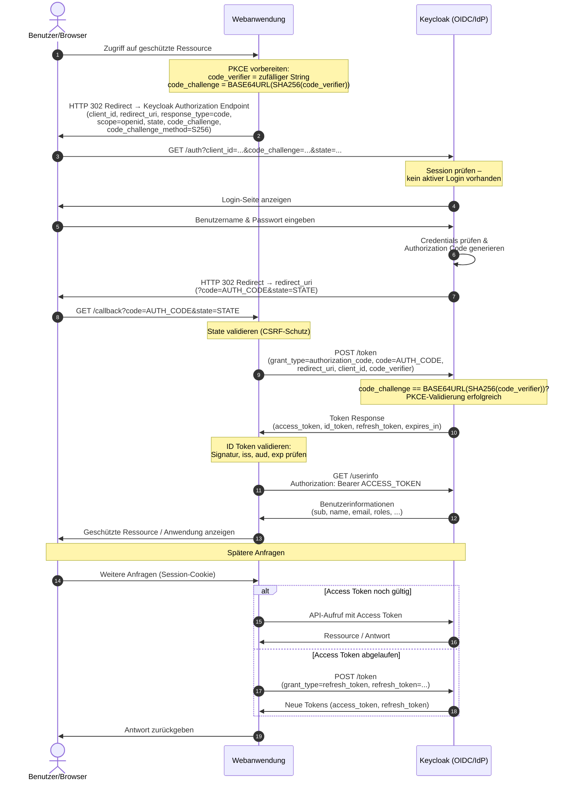

# OIDC Sequenzdiagramm mit PKCE (Proof Key for Code Exchange)

```mermaid
sequenceDiagram
autonumber
actor User as Benutzer/Browser
participant App as Webanwendung
participant KC as Keycloak (OIDC/IdP)

    User->>App: Zugriff auf geschützte Ressource
    Note over App: PKCE vorbereiten:<br/>code_verifier = zufälliger String<br/>code_challenge = BASE64URL(SHA256(code_verifier))
    App->>User: HTTP 302 Redirect → Keycloak Authorization Endpoint<br/>(client_id, redirect_uri, response_type=code,<br/>scope=openid, state, code_challenge,<br/>code_challenge_method=S256)
    User->>KC: GET /auth?client_id=...&code_challenge=...&state=...
    Note over KC: Session prüfen –<br/>kein aktiver Login vorhanden
    KC->>User: Login-Seite anzeigen
    User->>KC: Benutzername & Passwort eingeben
    KC->>KC: Credentials prüfen &<br/>Authorization Code generieren
    KC->>User: HTTP 302 Redirect → redirect_uri<br/>(?code=AUTH_CODE&state=STATE)
    User->>App: GET /callback?code=AUTH_CODE&state=STATE
    Note over App: State validieren (CSRF-Schutz)
    App->>KC: POST /token<br/>(grant_type=authorization_code, code=AUTH_CODE,<br/>redirect_uri, client_id, code_verifier)
    Note over KC: code_challenge == BASE64URL(SHA256(code_verifier))?<br/>PKCE-Validierung erfolgreich
    KC->>App: Token Response<br/>(access_token, id_token, refresh_token, expires_in)
    Note over App: ID Token validieren:<br/>Signatur, iss, aud, exp prüfen
    App->>KC: GET /userinfo<br/>Authorization: Bearer ACCESS_TOKEN
    KC->>App: Benutzerinformationen<br/>(sub, name, email, roles, ...)
    App->>User: Geschützte Ressource / Anwendung anzeigen
    Note over User, KC: Spätere Anfragen
    User->>App: Weitere Anfragen (Session-Cookie)

    alt Access Token noch gültig
        App->>KC: API-Aufruf mit Access Token
        KC->>App: Ressource / Antwort
    else Access Token abgelaufen
        App->>KC: POST /token<br/>(grant_type=refresh_token, refresh_token=...)
        KC->>App: Neue Tokens (access_token, refresh_token)
    end

    App->>User: Antwort zurückgeben
```
  