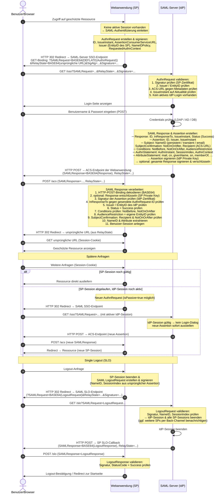

# Sequenzdiagramm SAML Authentication Flow

```mermaid
sequenceDiagram
    autonumber
    actor User as Benutzer/Browser
    participant App as Webanwendung (SP)
    participant SAML as SAML-Server (IdP)

    User->>App: Zugriff auf geschützte Ressource

    Note over App: Keine aktive Session vorhanden<br/>→ SAML-Authentifizierung einleiten

    %% ── AuthnRequest ────────────────────────────────────────────────
    Note over App: AuthnRequest erstellen & signieren:<br/>ID, IssueInstant, AssertionConsumerServiceURL,<br/>Issuer (EntityID des SP), NameIDPolicy,<br/>RequestedAuthnContext

    App->>User: HTTP 302 Redirect → SAML-Server SSO-Endpoint<br/>GET-Binding: ?SAMLRequest=BASE64(DEFLATE(AuthnRequest))<br/>&RelayState=BASE64(ursprüngliche URL)&SigAlg=...&Signature=...

    User->>SAML: GET /sso?SAMLRequest=...&RelayState=...&Signature=...

    Note over SAML: AuthnRequest validieren:<br/>1. Signatur prüfen (SP-Zertifikat)<br/>2. Issuer / EntityID prüfen<br/>3. ACS-URL gegen Metadaten prüfen<br/>4. IssueInstant auf Aktualität prüfen<br/>5. Kein aktives IdP-Login vorhanden

    %% ── Login ───────────────────────────────────────────────────────
    SAML->>User: Login-Seite anzeigen

    User->>SAML: Benutzername & Passwort eingeben (POST)

    SAML->>SAML: Credentials prüfen (LDAP / AD / DB)

    %% ── SAML Assertion erstellen ────────────────────────────────────
    Note over SAML: SAML Response & Assertion erstellen:<br/>─ Response: ID, InResponseTo, IssueInstant, Status (Success)<br/>─ Assertion: ID, Issuer, IssueInstant<br/>─ Subject: NameID (persistent / transient / email)<br/>  SubjectConfirmation: NotOnOrAfter, Recipient (ACS-URL)<br/>─ Conditions: NotBefore, NotOnOrAfter, AudienceRestriction<br/>─ AuthnStatement: AuthnInstant, SessionIndex, AuthnContext<br/>─ AttributeStatement: mail, cn, givenName, sn, memberOf, ...<br/>→ Assertion signieren (IdP Private Key)<br/>→ optional: gesamte Response signieren & verschlüsseln

    SAML->>User: HTTP POST → ACS-Endpoint der Webanwendung<br/>(SAMLResponse=BASE64(Response), RelayState=...)

    %% ── SP verarbeitet Response ─────────────────────────────────────
    User->>App: POST /acs (SAMLResponse=..., RelayState=...)

    Note over App: SAML Response verarbeiten:<br/>1. HTTP-POST-Binding dekodieren (BASE64)<br/>2. optional: Response entschlüsseln (SP Private Key)<br/>3. Signatur der Assertion prüfen (IdP-Zertifikat)<br/>4. InResponseTo gegen gesendete AuthnRequest-ID prüfen<br/>5. Issuer / EntityID des IdP prüfen<br/>6. Status = Success prüfen<br/>7. Conditions prüfen: NotBefore, NotOnOrAfter<br/>8. AudienceRestriction = eigene EntityID prüfen<br/>9. SubjectConfirmation: Recipient & NotOnOrAfter prüfen<br/>10. NameID & Attribute extrahieren<br/>11. Benutzer-Session anlegen

    App->>User: HTTP 302 Redirect → ursprüngliche URL (aus RelayState)

    User->>App: GET ursprüngliche URL (Session-Cookie)

    App->>User: Geschützte Ressource anzeigen

    %% ── Spätere Anfragen ────────────────────────────────────────────
    Note over User, SAML: Spätere Anfragen

    User->>App: Weitere Anfragen (Session-Cookie)

    alt SP-Session noch gültig
        App->>User: Ressource direkt ausliefern
    else SP-Session abgelaufen, IdP-Session noch aktiv
        Note over App: Neuer AuthnRequest (isPassive=true möglich)
        App->>User: HTTP 302 Redirect → SAML SSO-Endpoint
        User->>SAML: GET /sso?SAMLRequest=... (mit aktiver IdP-Session)
        Note over SAML: IdP-Session gültig → kein Login-Dialog<br/>neue Assertion sofort ausstellen
        SAML->>User: HTTP POST → ACS-Endpoint (neue Assertion)
        User->>App: POST /acs (neue SAMLResponse)
        App->>User: Redirect → Ressource (neue SP-Session)
    end

    %% ── Single Logout ───────────────────────────────────────────────
    Note over User, SAML: Single Logout (SLO)

    User->>App: Logout-Anfrage
    Note over App: SP-Session beenden &<br/>SAML LogoutRequest erstellen & signieren<br/>(NameID, SessionIndex aus ursprünglicher Assertion)

    App->>User: HTTP 302 Redirect → SAML SLO-Endpoint<br/>(?SAMLRequest=BASE64(LogoutRequest)&RelayState=...&Signature=...)

    User->>SAML: GET /slo?SAMLRequest=LogoutRequest...

    Note over SAML: LogoutRequest validieren:<br/>Signatur, NameID, SessionIndex prüfen<br/>→ IdP-Session & alle SP-Sessions beenden<br/>(ggf. weitere SPs per Back-Channel benachrichtigen)

    SAML->>SAML: IdP-Session beenden

    SAML->>User: HTTP POST → SP SLO-Callback<br/>(SAMLResponse=BASE64(LogoutResponse), RelayState=...)

    User->>App: POST /slo (SAMLResponse=LogoutResponse)

    Note over App: LogoutResponse validieren:<br/>Signatur, StatusCode = Success prüfen

    App->>User: Logout-Bestätigung / Redirect zur Startseite
```