# Claude Code Architektur

Dieses Diagramm zeigt die Architektur von Claude Code mit allen Konnektoren und Komponenten.

```mermaid
flowchart TB
    subgraph User["Benutzer"]
        CLI["Terminal/CLI"]
        VSCode["VS Code Extension"]
        Web["Claude.ai Web"]
        Chrome["Chrome Extension"]
    end

    subgraph ClaudeCode["Claude Code"]
        Core["Core Engine"]

        subgraph Models["Modelle"]
            Opus["Opus 4.5"]
            Sonnet["Sonnet 4"]
            Haiku["Haiku 4.5"]
        end

        subgraph Tools["Built-in Tools"]
            Bash["Bash"]
            Read["Read"]
            Write["Write"]
            Edit["Edit"]
            Glob["Glob"]
            Grep["Grep"]
            WebFetch["WebFetch"]
            WebSearch["WebSearch"]
            LSP["LSP Tool"]
        end

        subgraph Agents["Subagents"]
            Task["Task Tool"]
            Explore["Explore Agent"]
            Plan["Plan Agent"]
            Custom["Custom Agents"]
        end

        subgraph Extensions["Erweiterungen"]
            Skills["Skills"]
            Slash["Slash Commands"]
            Plugins["Plugins"]
            Hooks["Hooks System"]
            OutputStyles["Output Styles"]
        end

        subgraph Config["Konfiguration"]
            ClaudeMD["CLAUDE.md"]
            Settings["settings.json"]
            Memory["Memory/Rules"]
        end
    end

    subgraph External["Externe Konnektoren"]
        subgraph MCP["MCP Server"]
            MCPStdio["stdio"]
            MCPSSE["SSE"]
            MCPHttp["Streamable HTTP"]
            MCPOAuth["OAuth Support"]
        end

        subgraph Auth["Authentifizierung"]
            API["API Key"]
            OAuth["OAuth"]
            Bedrock["AWS Bedrock"]
            Vertex["Google Vertex"]
            Foundry["Azure Foundry"]
            Max["Claude Max/Pro"]
        end

        subgraph Services["Dienste"]
            Git["Git/GitHub"]
            DB["Datenbanken"]
            Prometheus["Prometheus"]
            OTEL["OpenTelemetry"]
        end
    end

    %% Benutzer-Verbindungen
    CLI --> Core
    VSCode --> Core
    Web -->|Teleport| Core
    Chrome -->|Browser Control| Core

    %% Core zu Modellen
    Core --> Opus
    Core --> Sonnet
    Core --> Haiku

    %% Core zu Tools
    Core --> Bash
    Core --> Read
    Core --> Write
    Core --> Edit
    Core --> Glob
    Core --> Grep
    Core --> WebFetch
    Core --> WebSearch
    Core --> LSP

    %% Core zu Agents
    Core --> Task
    Task --> Explore
    Task --> Plan
    Task --> Custom

    %% Core zu Extensions
    Core --> Skills
    Core --> Slash
    Core --> Plugins
    Core --> Hooks
    Core --> OutputStyles

    %% Core zu Config
    ClaudeMD --> Core
    Settings --> Core
    Memory --> Core

    %% Externe Verbindungen
    Core --> MCPStdio
    Core --> MCPSSE
    Core --> MCPHttp
    MCPOAuth --> MCP

    Core --> API
    Core --> OAuth
    Core --> Bedrock
    Core --> Vertex
    Core --> Foundry
    Core --> Max

    Bash --> Git
    Core --> DB
    Core --> Prometheus
    Core --> OTEL
```

## Komponenten-Beschreibung

### Benutzer-Schnittstellen
- **Terminal/CLI**: Hauptinterface für Entwickler
- **VS Code Extension**: Integrierte IDE-Unterstützung
- **Claude.ai Web**: Web-Interface mit Teleport-Funktion
- **Chrome Extension**: Browser-Steuerung direkt aus Claude Code

### Modelle
- **Opus 4.5**: Leistungsstärkstes Modell für komplexe Aufgaben
- **Sonnet 4**: Ausgewogenes Modell für die meisten Anwendungsfälle
- **Haiku 4.5**: Schnelles, kostengünstiges Modell für einfache Aufgaben

### Built-in Tools
| Tool | Beschreibung |
|------|--------------|
| Bash | Shell-Befehle ausführen |
| Read | Dateien lesen |
| Write | Dateien schreiben |
| Edit | Dateien bearbeiten |
| Glob | Dateimuster suchen |
| Grep | Textsuche in Dateien |
| WebFetch | Webseiten abrufen |
| WebSearch | Websuche durchführen |
| LSP | Language Server Protocol |

### Subagents
- **Task Tool**: Startet spezialisierte Unteragenten
- **Explore Agent**: Schnelle Codebase-Exploration (Haiku)
- **Plan Agent**: Architekturplanung und Design
- **Custom Agents**: Benutzerdefinierte Agenten

### Erweiterungen
- **Skills**: Wiederverwendbare Aufgaben-Templates
- **Slash Commands**: Schnellbefehle (/commit, /pr, etc.)
- **Plugins**: Externe Erweiterungen
- **Hooks**: Pre/Post Tool-Ausführung
- **Output Styles**: Anpassbare Ausgabeformate

### MCP Server (Model Context Protocol)
- **stdio**: Standard Input/Output
- **SSE**: Server-Sent Events
- **Streamable HTTP**: HTTP-basierte Kommunikation
- **OAuth Support**: Authentifizierung für externe Dienste

### Authentifizierung
- **API Key**: Direkte Anthropic API
- **OAuth**: Web-basierte Authentifizierung
- **AWS Bedrock**: Amazon Cloud Integration
- **Google Vertex**: Google Cloud Integration
- **Azure Foundry**: Microsoft Cloud Integration
- **Claude Max/Pro**: Abonnement-basiert
