# Claude Code - ZEV Integration

Dieses Diagramm zeigt, wie Claude Code mit dem ZEV-Projekt verbunden ist.

```mermaid
flowchart TB
    subgraph ClaudeCode["Claude Code"]
        Core["Core Engine"]

        subgraph Tools["Tools"]
            Bash["Bash"]
            Read["Read"]
            Write["Write"]
            Edit["Edit"]
            Glob["Glob"]
            Grep["Grep"]
            Task["Task/Agents"]
        end

        subgraph Skills["ZEV Skills"]
            Umsetzungsplan["/1_umsetzungsplan"]
            Umsetzung["/2_umsetzung"]
            BackendTests["/3_backend-tests"]
            FrontendTests["/4_frontend-unit-tests"]
            E2ETests["/5_e2e-tests"]
        end
    end

    subgraph MCP["MCP Server"]
        ZEVDB["zev-db"]
    end

    subgraph ZEVProject["ZEV Projekt"]
        subgraph Backend["backend-service"]
            Controllers["Controllers"]
            Services["Services"]
            Repositories["Repositories"]
            Entities["Entities"]
            Flyway["Flyway Migrations"]
        end

        subgraph Frontend["frontend-service"]
            Components["Components"]
            FEServices["Services"]
            Models["Models"]
            PlaywrightTests["Playwright E2E"]
        end

        subgraph Admin["admin-service"]
            AdminAPI["Admin API"]
        end

        subgraph DesignSystem["design-system"]
            Tokens["Design Tokens"]
            UIComponents["UI Components"]
        end

        subgraph Specs["Specs/"]
            FeatureSpecs["Feature Specs"]
            Umsetzungsplaene["Umsetzungspläne"]
        end

        subgraph Config["Konfiguration"]
            ClaudeMD["CLAUDE.md"]
            DockerCompose["docker-compose.yml"]
            POM["pom.xml"]
        end
    end

    subgraph Infrastructure["Infrastruktur (Docker)"]
        PostgreSQL[("PostgreSQL")]
        Keycloak["Keycloak"]
        Prometheus["Prometheus"]
        Grafana["Grafana"]
    end

    subgraph TestTools["Test-Infrastruktur"]
        Maven["Maven Surefire/Failsafe"]
        Karma["Karma/Jasmine"]
        Playwright["Playwright"]
        TestContainers["TestContainers"]
    end

    %% Claude Code Verbindungen
    Core --> Tools
    Core --> Skills
    Core --> ZEVDB

    %% MCP zu Datenbank
    ZEVDB -->|SQL Queries| PostgreSQL

    %% Tools zu Projekt
    Read --> Backend
    Read --> Frontend
    Read --> Admin
    Read --> DesignSystem
    Read --> Specs

    Write --> Backend
    Write --> Frontend
    Write --> DesignSystem

    Edit --> Controllers
    Edit --> Services
    Edit --> Components
    Edit --> FEServices

    Glob --> ZEVProject
    Grep --> ZEVProject

    %% Skills zu Aktionen
    Umsetzungsplan --> Specs
    Umsetzung --> Backend
    Umsetzung --> Frontend
    BackendTests --> Maven
    FrontendTests --> Karma
    E2ETests --> Playwright

    %% Bash Kommandos
    Bash --> Maven
    Bash --> Karma
    Bash --> Playwright
    Bash --> DockerCompose

    %% Backend Schichten
    Controllers --> Services
    Services --> Repositories
    Repositories --> Entities
    Entities --> Flyway

    %% Frontend zu Design System
    Components --> UIComponents
    Components --> Tokens

    %% Infrastruktur-Verbindungen
    Backend -->|JDBC| PostgreSQL
    Backend -->|OAuth2/JWT| Keycloak
    Backend -->|Metrics| Prometheus
    Prometheus --> Grafana

    Frontend -->|REST API| Backend
    Frontend -->|Auth| Keycloak

    Admin -->|REST API| Backend

    %% Test-Verbindungen
    Maven --> TestContainers
    TestContainers --> PostgreSQL
    Playwright --> Frontend

    %% Styling
    classDef claude fill:#4F46E5,stroke:#312E81,color:#fff
    classDef mcp fill:#7C3AED,stroke:#5B21B6,color:#fff
    classDef backend fill:#059669,stroke:#065F46,color:#fff
    classDef frontend fill:#0891B2,stroke:#155E75,color:#fff
    classDef infra fill:#DC2626,stroke:#991B1B,color:#fff
    classDef test fill:#CA8A04,stroke:#854D0E,color:#fff

    class Core,Bash,Read,Write,Edit,Glob,Grep,Task claude
    class ZEVDB mcp
    class Controllers,Services,Repositories,Entities,Flyway,AdminAPI backend
    class Components,FEServices,Models,PlaywrightTests,Tokens,UIComponents frontend
    class PostgreSQL,Keycloak,Prometheus,Grafana infra
    class Maven,Karma,Playwright,TestContainers test
```



## Verbindungen im Detail

### MCP Server: zev-db
Claude Code hat direkten SQL-Zugriff auf die PostgreSQL-Datenbank über den konfigurierten MCP Server:
```sql
-- Beispiel-Abfragen
SELECT * FROM einheit;
SELECT * FROM messwerte WHERE einheit_id = 1;
SELECT * FROM tarif WHERE tariftyp = 'ZEV';
```

### Skills (Slash Commands)
| Skill | Beschreibung |
|-------|--------------|
| `/1_umsetzungsplan` | Erstellt Umsetzungspläne basierend auf Specs |
| `/2_umsetzung` | Implementiert Features nach Plan |
| `/3_backend-tests` | Generiert Backend Unit/Integration Tests |
| `/4_frontend-unit-tests` | Generiert Frontend Unit Tests |
| `/5_e2e-tests` | Generiert Playwright E2E Tests |

### Code-Vorlagen (aus CLAUDE.md)
Claude Code verwendet diese Dateien als Referenz für konsistente Code-Generierung:

#### Backend
| Typ | Vorlage |
|-----|---------|
| Entity | `Tarif.java` |
| Repository | `TarifRepository.java` |
| Service | `TarifService.java` |
| Controller | `TarifController.java` |

#### Frontend
| Typ | Vorlage |
|-----|---------|
| Model | `tarif.model.ts` |
| Service | `tarif.service.ts` |
| List Component | `tarif-list/` |
| Form Component | `tarif-form/` |

### Bash-Kommandos
```bash
# Backend Tests
mvn test                           # Unit Tests
mvn verify                         # Integration Tests

# Frontend Tests
npm test                           # Karma/Jasmine
npm run e2e                        # Playwright

# Docker
docker-compose up --build          # Gesamte Infrastruktur
```

### Datenfluss
```
Benutzer-Anfrage
       │
       ▼
┌─────────────────┐
│   Claude Code   │
│   (Opus 4.5)    │
└────────┬────────┘
         │
    ┌────┴────┬─────────┬──────────┐
    ▼         ▼         ▼          ▼
┌───────┐ ┌───────┐ ┌───────┐ ┌────────┐
│ Read  │ │ Edit  │ │ Bash  │ │ zev-db │
│ Files │ │ Files │ │ Tests │ │  MCP   │
└───┬───┘ └───┬───┘ └───┬───┘ └────┬───┘
    │         │         │          │
    ▼         ▼         ▼          ▼
┌─────────────────────────────────────┐
│           ZEV Codebase              │
│  Backend │ Frontend │ Design System │
└─────────────────────────────────────┘
```
