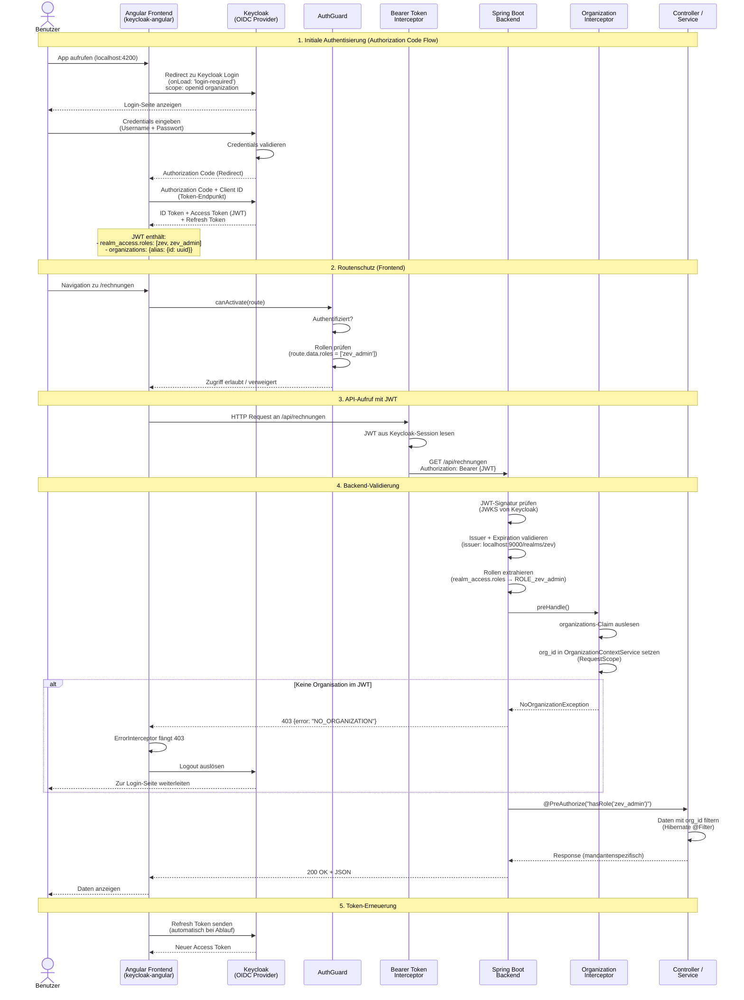
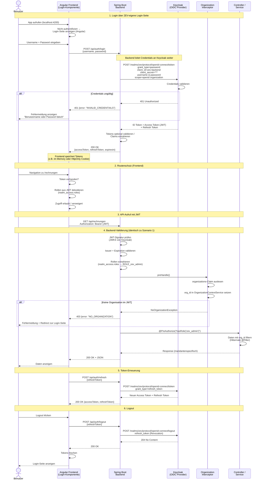

# OIDC-Authentisierung (Sequenzdiagramm)

Dieses Diagramm zeigt den vollständigen Authentisierungsfluss eines Benutzers über OpenID Connect mit Keycloak.

---

## Szenario 2: Login-Seite von der ZEV-Anwendung bereitgestellt

In diesem Szenario rendert die ZEV-Anwendung eine eigene Login-Seite. Die Credentials werden über das Backend an Keycloak weitergeleitet (Resource Owner Password Credentials / Direct Access Grant). Der Benutzer verlässt nie die ZEV-Oberfläche.

### Unterschiede zu Szenario 1 (Keycloak-Login-Seite)

| Aspekt | Szenario 1 (Keycloak-Seite) | Szenario 2 (ZEV-Login-Seite) |
|--------|----------------------------|-------------------------------|
| **Login-UI** | Keycloak rendert Login-Seite | Angular rendert eigene Login-Komponente |
| **Flow** | Authorization Code Flow (+ PKCE) | Resource Owner Password Credentials (Direct Access Grant) |
| **Redirect** | Browser-Redirect zu Keycloak und zurück | Kein Redirect, alles in der ZEV-App |
| **Token-Austausch** | Frontend ↔ Keycloak direkt | Frontend → Backend → Keycloak (Proxy) |
| **Client-Typ** | Public Client (kein Secret) | Confidential Client (Secret im Backend) |
| **Sicherheit** | Empfohlen (Credentials nur bei Keycloak) | Credentials passieren das Backend |
| **MFA / Social Login** | Nativ unterstützt via Keycloak-UI | Muss selbst implementiert werden |
| **Token-Speicherung** | keycloak-angular verwaltet Session | Eigene Verwaltung (Memory / Cookie) |
| **Refresh** | keycloak-angular automatisch | Eigener Refresh-Mechanismus nötig |

> **Hinweis:** Szenario 1 (Authorization Code Flow) ist die empfohlene Variante gemäss OAuth 2.1 und OIDC Best Practices. Der Resource Owner Password Credentials Grant in Szenario 2 wird in OAuth 2.1 nicht mehr empfohlen, bietet aber eine nahtlose UX ohne Redirect.

---

## Beteiligte Komponenten

| Komponente | Datei | Aufgabe |
|------------|-------|---------|
| Keycloak-Init | `app.config.ts` | Keycloak-Konfiguration (realm: `zev`, clientId: `zev-frontend`) |
| AuthGuard | `guards/auth.guard.ts` | Routenschutz basierend auf Rollen |
| Bearer Interceptor | `app.config.ts` (provideKeycloak) | JWT automatisch an API-Requests anhängen |
| Error Interceptor | `interceptors/error.interceptor.ts` | NO_ORGANIZATION-Fehler abfangen, Logout |
| SecurityConfig | `config/SecurityConfig.java` | JWT-Validierung, Rollen-Extraktion |
| OrganizationInterceptor | `config/OrganizationInterceptor.java` | org_id aus JWT extrahieren |
| OrganizationContextService | `service/OrganizationContextService.java` | org_id im Request-Scope speichern |
| GlobalExceptionHandler | `exception/GlobalExceptionHandler.java` | NoOrganizationException → 403 |
